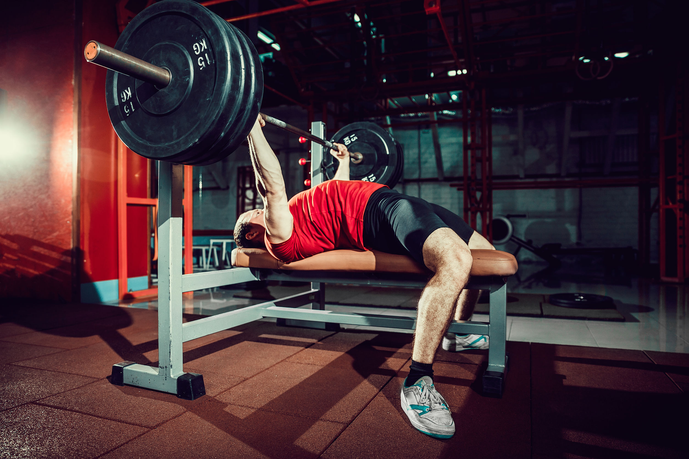

# Gabriel Will Storti

<!DOCTYPE html>
<html>

<html lang="pt-br">
    <head>
      <meta charset="UTF-8">
      <title>Os Benefícios da Academia</title>
      <link rel="stylesheet" href="style.css">
      
      
    </head>

    <body>

      <header>
        <h1>Os Benefícios da Academia</h1>
      </header>

      <main>

        <section>
          <h2>Melhora a Saúde Física e Mental</h2>
            
Ir à academia regularmente pode ajudar a melhorar a saúde física e mental. A prática de atividades físicas ajuda a fortalecer o corpo, melhorar a resistência e aumentar a flexibilidade. Além disso, exercícios físicos liberam endorfinas, que são hormônios responsáveis por proporcionar sensação de bem-estar e felicidade.

        </section>

        <section>
          <h2>Reduz o Risco de Doenças Crônicas</h2>
            
Ir à academia pode ajudar a reduzir o risco de desenvolver doenças crônicas, como diabetes, hipertensão arterial e doenças cardíacas. Isso acontece porque a prática regular de atividades físicas ajuda a manter o corpo saudável, reduzindo a pressão arterial e controlando os níveis de açúcar no sangue.

        </section>

        <section>
          <h2>Aumenta a Autoestima e a Confiança</h2>
            
Ir à academia regularmente pode ajudar a aumentar a autoestima e a confiança. Isso acontece porque, ao praticar atividades físicas, o corpo produz endorfinas, que proporcionam sensação de bem-estar e felicidade. Além disso, o processo de alcançar objetivos de condicionamento físico pode ajudar a melhorar a autoconfiança e a autoestima.

        </section>

        <section>
          <h1></h1>
        </section>

      </main>

        <h2>Benefícios da Esteira:</h2>
          <li>Ajuda a queimar calorias</li>
            <li>Melhora a Saúde cardiovascular</li>
              <li>Fortalece os músculos da perna</li>
                <li>Ajuda a reduzir o estresse</li>
     
      
        

        <h2>Benefícios do Supino:</h2>
          <li>Fortalece o peitoral</li>
            <li>Melhora apostura</li>
              <li>Ganho de força</li>
                <li>Ajuda a prevenir lesões</li>
     
      
    </body>

  </html>
  
